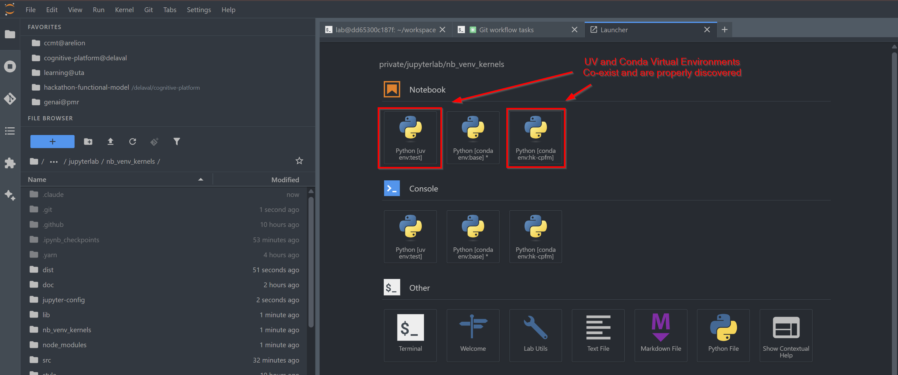
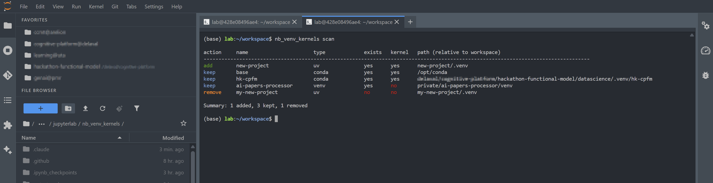
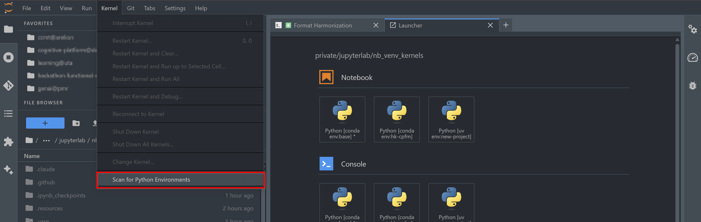
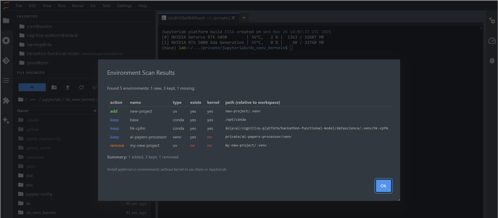
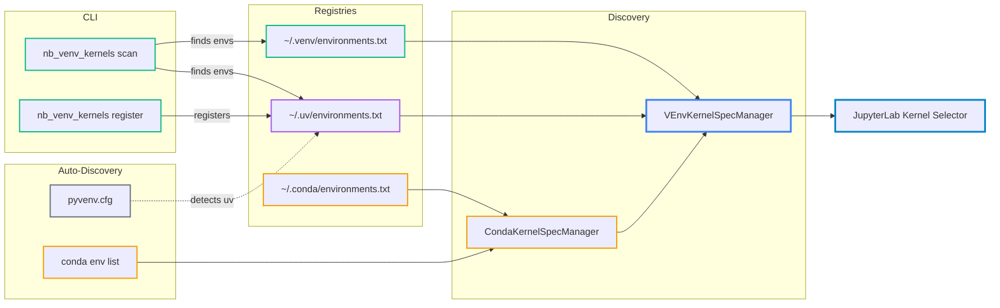
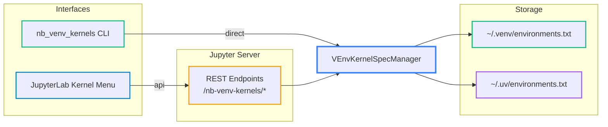

# nb_venv_kernels

[](https://github.com/stellarshenson/nb_venv_kernels/actions/workflows/build.yml)
[](https://www.npmjs.com/package/nb_venv_kernels)
[](https://pypi.org/project/nb_venv_kernels/)
[](https://pepy.tech/project/nb_venv_kernels)
[](https://jupyterlab.readthedocs.io/en/stable/)
[](https://kolomolo.com)
[](https://www.paypal.com/donate/?hosted_button_id=B4KPBJDLLXTSA)

Use Python virtual environments as Jupyter kernels. Discovers and registers kernels from venv, uv, and conda environments in JupyterLab's kernel selector.

This kernel spec manager is used by [Stellars Cookiecutter Data Science](https://github.com/stellarshenson/cookiecutter-data-science) - a fork of the popular data science project template that supports both cookiecutter and copier templating engines. The template uses nb_venv_kernels to automatically manage Jupyter kernels for project environments

Discovered environments appear in JupyterLab's kernel selector.



CLI provides environment listing with status indicators.



Scan for environments directly from JupyterLab's Kernel menu.



Results display in a modal with action indicators.



## Features

- **Unified kernel discovery** - conda, venv, and uv environments in one kernel selector
- **Auto-detection** - distinguishes uv from venv via `pyvenv.cfg`
- **Smart ordering** - current environment first, then conda, uv, venv, system
- **Drop-in replacement** - replaces [nb_conda_kernels](https://github.com/Anaconda-Platform/nb_conda_kernels) while preserving all conda functionality
- **Directory scanning** - scan project directories to find and register environments
- **JupyterLab integration** - scan for environments from Kernel menu with results modal
- **CLI management** - register, unregister, scan, list with color-coded status indicators
- **Programmatic API** - REST endpoints and Python API for automation (`--json` flag)
- **Zero config** - auto-enables on install, works immediately

_Built because someone got tired of typing `python -m ipykernel install --user --name=...` for the 42nd time._

## Install

This package should be installed in the environment from which you run Jupyter Notebook or JupyterLab. This might be your base conda environment, but it need not be. For instance, if you have a dedicated `jupyter_env` environment:

```bash
conda activate jupyter_env
pip install nb_venv_kernels
```

Or install directly with pip/uv if not using conda:

```bash
pip install nb_venv_kernels
```

The extension auto-enables as the default kernel spec manager via `jupyter_config.json`. If nb_conda_kernels is installed, nb_venv_kernels takes precedence and includes all conda kernel discovery functionality.

## Usage

Virtual environments require `ipykernel` installed to be discoverable. The `ipykernel` package creates the kernel spec at `{env}/share/jupyter/kernels/*/kernel.json`.

```bash
# In your virtual environment
pip install ipykernel
```

### Scanning for Environments

Scan a directory tree to find and register all venv/uv environments:

```bash
nb_venv_kernels scan                      # Scan current directory
nb_venv_kernels scan /path/to/projects    # Scan specific directory
nb_venv_kernels scan --depth 3            # Limit recursion depth (default: 5)
```

The scan command automatically:

- Finds venv and uv environments by detecting `bin/python`
- Registers them in the appropriate registry (`~/.venv/` or `~/.uv/`)
- Cleans up non-existent environments from registries
- Reports conda environments found (they are discovered via `conda env list`)

### Manual Registration

```bash
nb_venv_kernels register /path/to/.venv
nb_venv_kernels register /path/to/.venv -n "My Project"  # With custom display name
nb_venv_kernels unregister /path/to/.venv
nb_venv_kernels unregister -n "My Project"               # Unregister by name
```

Custom names are stored in the registry and used in kernel display names (venv/uv only, ignored for conda). Re-registering an existing environment with a different name updates it.

### Listing Environments

The `list` command shows all environments (conda, uv, venv) with their status:

```bash
nb_venv_kernels list
```

```
name                      type             exists   kernel   path
--------------------------------------------------------------------------------------------------------------
base                      conda            yes      yes      /opt/conda
my-conda-env              conda (local)    yes      yes      /opt/conda/envs/my-conda-env
my-project                uv               yes      yes      /home/user/my-project/.venv
another-project           venv             yes      no       /home/user/another-project/venv
```

Environments are sorted by type (conda, uv, venv) then by name. The KERNEL column indicates whether `ipykernel` is installed. Missing environments and kernels display "no" in red. Duplicate names are automatically resolved with `_1`, `_2` suffixes.

### Jupyter Configuration

```bash
nb_venv_kernels config enable     # Enable VEnvKernelSpecManager
nb_venv_kernels config disable    # Disable VEnvKernelSpecManager
nb_venv_kernels config show       # Show current config status
```

Registered environments with ipykernel appear in JupyterLab's kernel selector.

## Environment Registries

Environments are registered in separate files based on their source:

- **venv**: `~/.venv/environments.txt`
- **uv**: `~/.uv/environments.txt`
- **conda**: `~/.conda/environments.txt` + global environments from `conda env list`

Registry format is plain text with optional tab-separated custom names:

```
/path/to/env
/path/to/other/env	custom-name
```

The `register` command auto-detects uv environments via `pyvenv.cfg` and writes to the appropriate registry.

## How It Works

Environment registration and kernel discovery flow:



CLI and JupyterLab interface architecture:



- Scans `{path}/share/jupyter/kernels/*/kernel.json` for each registered environment
- Configures kernel to use venv's python directly with `VIRTUAL_ENV` and `PATH` environment variables
- Kernel order: current environment first, then conda, uv, venv, system
- Caches results for 60 seconds
- `config enable` backs up existing config, `config disable` restores from backup
- CLI calls VEnvKernelSpecManager directly; JupyterLab frontend uses REST endpoints

For detailed technical documentation, see [Environment Discovery Mechanism](doc/NB_VENV_KERNELS_MECHANICS.md).

## Configuration

Optional settings in `jupyter_server_config.py`:

```python
c.VEnvKernelSpecManager.venv_only = True                      # Hide system/conda kernels
c.VEnvKernelSpecManager.env_filter = r"\.tox|\.nox"           # Exclude by pattern
c.VEnvKernelSpecManager.name_format = "{language} [{source} env:{environment}]"  # Default format
c.VEnvKernelSpecManager.scan_depth = 10                       # Default depth for scan command
c.VEnvKernelSpecManager.require_kernelspec = True             # Only register envs with ipykernel
```

**Display name variables**: `{language}`, `{environment}`, `{source}` (uv/venv), `{kernel}`, `{display_name}`

## Programmatic API

The extension provides REST and Python APIs for integration with tools and automation. See [API Documentation](doc/API.md) for details on:

- **REST endpoints** - /nb-venv-kernels/environments, /scan, /register, /unregister
- **Python API** - VEnvKernelSpecManager methods for listing, scanning, and registering environments
- **JSON output** - CLI commands support `--json` flag for machine-to-machine communication

## Uninstall

```bash
pip uninstall nb_venv_kernels
```

After uninstall, nb_conda_kernels (if installed) will resume handling kernel discovery.
