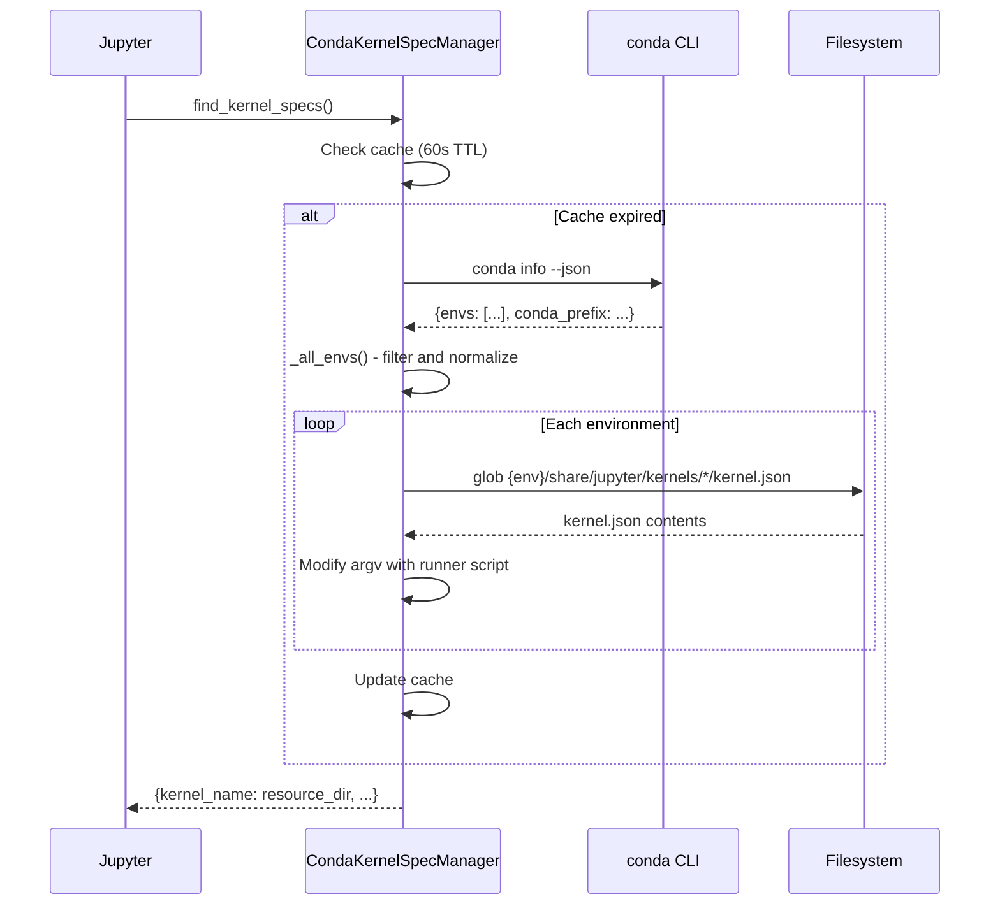

# nb_conda_kernels - Environment Discovery Mechanism

@nb_venv_kernels version: 1.1.31<br>
@created on: 2025-11-27

This document describes how nb_conda_kernels discovers and presents conda environments as Jupyter kernels.

## Overview

nb_conda_kernels extends Jupyter's `KernelSpecManager` to dynamically discover kernels installed in conda environments without requiring manual registration. The extension scans environments, locates kernelspecs, and presents them to Jupyter with a wrapper script that handles environment activation.

## Discovery Flow



## Step 1: Environment Enumeration

The `_all_envs()` method retrieves all conda environments:

```python
# Execute conda info --json
subprocess.check_output([CONDA_EXE, "info", "--json"])
```

Returns JSON structure:

```json
{
  "envs": [
    "/opt/conda",
    "/opt/conda/envs/myenv",
    "/home/user/projects/myproject/.venv/custom-env"
  ],
  "conda_prefix": "/opt/conda",
  "envs_dirs": ["/opt/conda/envs", "/home/user/.conda/envs"]
}
```

**Key points**:

- `envs` array contains ALL environments including prefix-based (created with `--prefix`)
- `envs_dirs` lists standard environment directories
- Prefix-based environments appear in `envs` but not in `conda env list` output
- Build directories (`conda-bld/`) are excluded

Environment naming logic:

- Base environment -> configured `base_name` (default: "base")
- Standard envs -> directory name (e.g., `myenv`)
- Prefix envs -> directory name with disambiguation if needed

## Step 2: Kernelspec Discovery

The `_all_specs()` method scans each environment for installed kernels:

```python
for env_name, env_path in all_envs.items():
    kspec_base = join(env_path, 'share', 'jupyter', 'kernels')
    kspec_glob = glob.glob(join(kspec_base, '*', 'kernel.json'))
```

Search path pattern:

```
{env_path}/share/jupyter/kernels/*/kernel.json
```

Example locations:

```
/opt/conda/share/jupyter/kernels/python3/kernel.json
/opt/conda/envs/myenv/share/jupyter/kernels/python3/kernel.json
/home/user/project/.venv/hk-cpfm/share/jupyter/kernels/python3/kernel.json
```

## Step 3: Kernelspec Modification

Original `kernel.json` (installed by ipykernel with `--sys-prefix`):

```json
{
  "argv": [
    "/opt/conda/envs/myenv/bin/python",
    "-m",
    "ipykernel_launcher",
    "-f",
    "{connection_file}"
  ],
  "display_name": "Python 3 (ipykernel)",
  "language": "python",
  "metadata": { "debugger": true }
}
```

Modified by nb_conda_kernels:

```json
{
  "argv": [
    "python",
    "-m",
    "nb_conda_kernels.runner",
    "/opt/conda",
    "/opt/conda/envs/myenv",
    "/opt/conda/envs/myenv/bin/python",
    "-m",
    "ipykernel_launcher",
    "-f",
    "{connection_file}"
  ],
  "display_name": "Python [conda env:myenv]",
  "language": "python",
  "metadata": {
    "debugger": true,
    "conda_env_name": "myenv",
    "conda_env_path": "/opt/conda/envs/myenv",
    "conda_language": "Python",
    "conda_raw_kernel_name": "python3",
    "conda_is_base_environment": false,
    "conda_is_currently_running": false
  }
}
```

**Modifications**:

- `argv` prepended with runner script and conda/env paths
- `display_name` reformatted using configurable template
- `metadata` enriched with environment information

## Step 4: Kernel Launch (Runner Script)

When user selects a kernel, Jupyter executes the modified argv. The runner script (`nb_conda_kernels/runner.py`) activates the target environment before launching the kernel.

**Unix execution**:

```bash
. '/opt/conda/bin/activate' '/opt/conda/envs/myenv' && \
exec /opt/conda/envs/myenv/bin/python -m ipykernel_launcher -f {connection_file}
```

**Windows execution**:

```batch
call %CONDA_PREFIX%\Scripts\activate.bat %ENV_PATH% && %COMMAND%
```

The runner ensures:

- Environment variables are set correctly (CONDA_PREFIX, PATH, etc.)
- Kernel process replaces runner process (via `exec`)
- No orphan processes remain

## Step 5: Jupyter Integration

The manager registers with Jupyter via configuration:

```python
# jupyter_server_config.py or jupyter_notebook_config.py
c.ServerApp.kernel_spec_manager_class = "nb_conda_kernels.CondaKernelSpecManager"
```

The `CondaKernelSpecManager` overrides three key methods:

| Method                  | Purpose                                              |
| ----------------------- | ---------------------------------------------------- |
| `find_kernel_specs()`   | Returns dict of kernel names to resource directories |
| `get_kernel_spec(name)` | Returns KernelSpec instance for given name           |
| `get_all_specs()`       | Returns full metadata for all kernels                |

## Caching Strategy

Two-level caching minimizes overhead:

| Cache                  | TTL | Contents                      |
| ---------------------- | --- | ----------------------------- |
| `_conda_info_cache`    | 60s | Output of `conda info --json` |
| `_conda_kernels_cache` | 60s | Processed KernelSpec objects  |

Background threading prevents blocking:

- First call blocks while fetching conda info
- Subsequent calls return cached data
- Cache refresh happens asynchronously in background thread

## Configuration Options

| Option            | Default                                | Description                                  |
| ----------------- | -------------------------------------- | -------------------------------------------- |
| `base_name`       | "base"                                 | Display name for root environment            |
| `conda_only`      | False                                  | Show only conda kernels, hide system kernels |
| `env_filter`      | None                                   | Regex to exclude environments                |
| `name_format`     | `{language} [conda env:{environment}]` | Display name template                        |
| `kernelspec_path` | None                                   | Optionally install specs to disk             |
| `enable_debugger` | None                                   | Override debugger metadata                   |

## Why Standard Jupyter Doesn't See These Kernels

Jupyter searches for kernelspecs in fixed locations:

- `{sys.prefix}/share/jupyter/kernels/` - current environment
- `~/.local/share/jupyter/kernels/` - user installation
- `/usr/share/jupyter/kernels/` - system-wide

Kernels installed with `ipykernel install --sys-prefix` inside a conda environment are placed in that environment's `share/jupyter/kernels/` - invisible to Jupyter running from a different environment.

nb_conda_kernels bridges this gap by actively scanning all environments and presenting their kernels dynamically.
