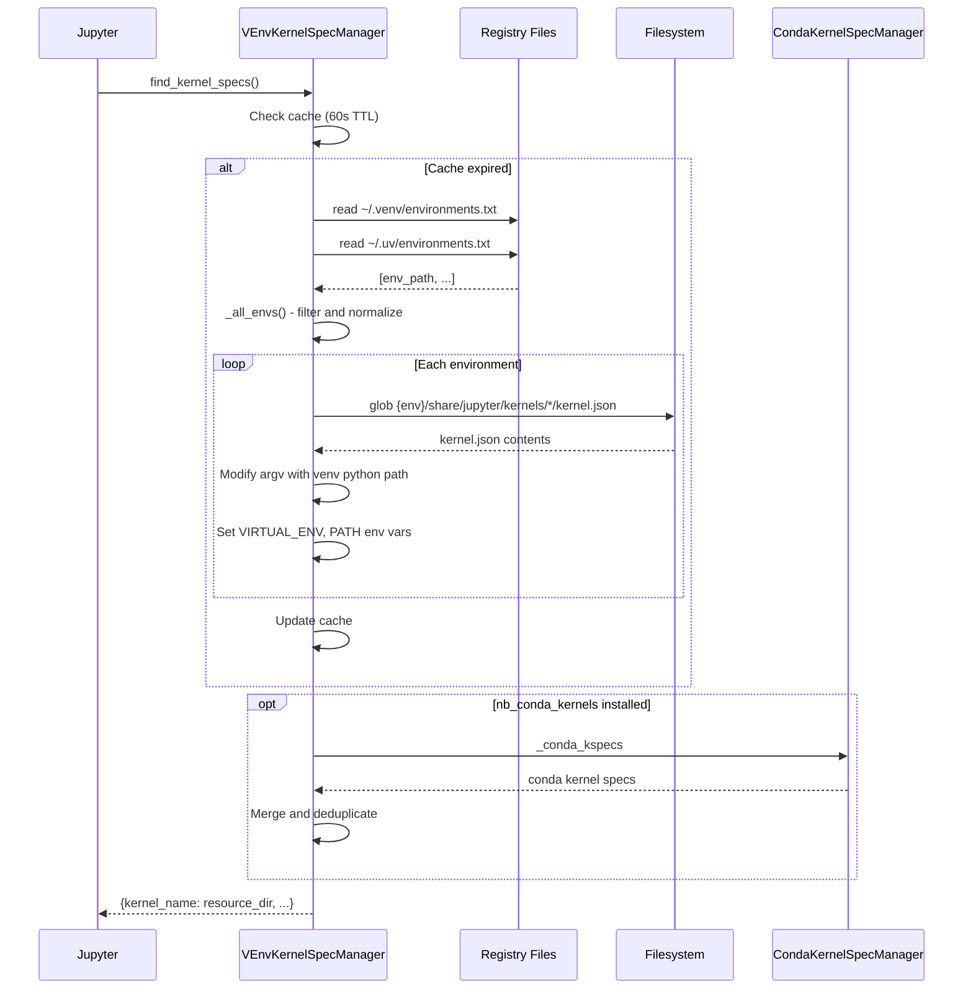

# nb_venv_kernels - Environment Discovery Mechanism

@nb_venv_kernels version: 1.2.9<br>
@created on: 2025-11-27

This document describes how nb_venv_kernels discovers and presents venv/uv environments as Jupyter kernels.

## Overview

nb_venv_kernels extends Jupyter's `KernelSpecManager` to discover kernels from registered virtual environments. Unlike nb_conda_kernels which relies on `conda env list`, nb_venv_kernels uses file-based registries and does not require a runner script - kernels execute using the venv's Python directly with environment variables.

## Discovery Flow



## Step 1: Environment Registration

Environments must be registered before discovery. Unlike nb_conda_kernels which auto-discovers via conda CLI, nb_venv_kernels uses file-based registries:

| Registry | Path                       | Source                  |
| -------- | -------------------------- | ----------------------- |
| venv     | `~/.venv/environments.txt` | Standard Python venv    |
| uv       | `~/.uv/environments.txt`   | uv-created environments |

Registration methods:

```bash
# CLI registration
nb_venv_kernels register /path/to/.venv
nb_venv_kernels register /path/to/.venv -n "My Project"  # With custom name

# Directory scanning
nb_venv_kernels scan /path/to/projects
```

Re-registering an existing environment with a different name updates the custom name in the registry.

Auto-detection of uv environments via `pyvenv.cfg`:

```python
def is_uv_environment(env_path: str) -> bool:
    pyvenv_cfg = os.path.join(env_path, "pyvenv.cfg")
    if os.path.exists(pyvenv_cfg):
        with open(pyvenv_cfg, "r") as f:
            for line in f:
                if line.strip().startswith("uv ="):
                    return True
    return False
```

## Step 2: Environment Enumeration

The `_all_envs()` method reads both registry files:

```python
for env_path in read_environments():
    # Apply filter if configured
    if self.env_filter and self._env_filter_regex.search(env_path):
        continue

    # Derive environment name from path
    env_dir = basename(env_path)
    if env_dir == ".venv":
        env_name = basename(dirname(env_path))  # Use project name
    else:
        env_name = env_dir

    all_envs[env_name] = env_path
```

Registry file format (plain text with optional tab-separated custom names):

```
/home/user/project-a/.venv
/home/user/project-b/venv	my-custom-name
/home/user/experiments/.virtualenv
```

Custom names are supported for venv/uv environments via the `-n/--name` option during registration. When provided, the custom name overrides the auto-derived name in the kernel selector.

## Step 3: Kernelspec Discovery

The `_all_venv_specs()` method scans each registered environment:

```python
for env_name, env_path in self._all_envs().items():
    kspec_base = join(env_path, "share", "jupyter", "kernels")
    kspec_glob = glob.glob(join(kspec_base, "*", "kernel.json"))
```

Search path pattern:

```
{env_path}/share/jupyter/kernels/*/kernel.json
```

Environments require `ipykernel` installed to be discoverable:

```bash
# Inside the virtual environment
pip install ipykernel
```

## Step 4: Kernelspec Modification

Original `kernel.json` (installed by ipykernel):

```json
{
  "argv": [
    "/home/user/project/.venv/bin/python",
    "-m",
    "ipykernel_launcher",
    "-f",
    "{connection_file}"
  ],
  "display_name": "Python 3 (ipykernel)",
  "language": "python"
}
```

Modified by nb_venv_kernels:

```json
{
  "argv": [
    "/home/user/project/.venv/bin/python",
    "-m",
    "ipykernel_launcher",
    "-f",
    "{connection_file}"
  ],
  "display_name": "Python [uv env:project]",
  "language": "python",
  "env": {
    "VIRTUAL_ENV": "/home/user/project/.venv",
    "PATH": "/home/user/project/.venv/bin:/opt/conda/bin:/usr/local/bin:...",
    "CONDA_PREFIX": "",
    "CONDA_DEFAULT_ENV": "",
    "CONDA_PROMPT_MODIFIER": "",
    "CONDA_SHLVL": "0"
  },
  "metadata": {
    "venv_env_name": "project",
    "venv_env_path": "/home/user/project/.venv",
    "venv_source": "uv",
    "venv_language": "Python",
    "venv_raw_kernel_name": "python3",
    "venv_is_currently_running": false
  }
}
```

**Key differences from nb_conda_kernels**:

- No runner script - uses venv's Python directly
- Environment variables set in kernelspec instead of activation script
- `VIRTUAL_ENV` set for proper venv detection
- `CONDA_*` variables cleared to avoid conda activation confusion
- PATH includes venv bin first, keeps conda base bin for tools (pip, uv)

## Step 5: Kernel Launch

When user selects a kernel, Jupyter executes the modified argv directly. The environment variables ensure:

- `VIRTUAL_ENV` points to the venv, enabling `pip install` to target correct environment
- `PATH` prioritizes venv bin, so `python`, `pip`, `uv` resolve to venv versions
- Conda environment variables are cleared to prevent conda activation interference

No intermediate runner process - the kernel process starts directly.

## Step 6: Conda Integration

If nb_conda_kernels is installed, VEnvKernelSpecManager uses composition to include conda kernels:

```python
if _HAS_CONDA:
    self._conda_manager = CondaKernelSpecManager(**kwargs)

@property
def _conda_kspecs(self):
    if self._conda_manager is None:
        return {}
    return self._conda_manager._conda_kspecs
```

Kernel merging removes duplicates:

```python
# Remove system kernels that have same resource_dir as conda kernels
conda_resource_dirs = {spec.resource_dir for spec in conda_kspecs.values()}
for sys_name in list(kspecs.keys()):
    if kspecs[sys_name] in conda_resource_dirs:
        del kspecs[sys_name]
```

## Step 7: Jupyter Integration

The manager registers via configuration:

```python
# jupyter_server_config.py
c.ServerApp.kernel_spec_manager_class = "nb_venv_kernels.VEnvKernelSpecManager"
```

Auto-enabled on install via `jupyter_config.json` data file.

| Method                  | Purpose                                              |
| ----------------------- | ---------------------------------------------------- |
| `find_kernel_specs()`   | Returns dict of kernel names to resource directories |
| `get_kernel_spec(name)` | Returns KernelSpec instance for given name           |
| `get_all_specs()`       | Returns full metadata for all kernels                |

## Kernel Ordering

Kernels are sorted by priority:

| Priority | Source  | Description                                   |
| -------- | ------- | --------------------------------------------- |
| 0        | Current | Currently active environment (marked with \*) |
| 1        | Conda   | Conda environments                            |
| 2        | UV      | uv-created environments                       |
| 3        | Venv    | Standard Python venv                          |
| 4        | System  | System-installed kernels                      |

Within each priority, kernels sort alphabetically by name.

## Scan Output Ordering

The `scan` command output (CLI and JupyterLab modal) sorts environments by three criteria:

| Priority | Field  | Order                                     |
| -------- | ------ | ----------------------------------------- |
| 1        | Action | add (0), update (1), keep (2), remove (3) |
| 2        | Type   | conda (0), uv (1), venv (2)               |
| 3        | Name   | Alphabetical (case-insensitive)           |

This ordering groups new environments first, then updated, then existing, then those scheduled for removal - with consistent type ordering within each action group.

**Action meanings:**

- **add** (green) - new environment being registered
- **update** (cyan) - environment where an actual change was made (name updated in registry or name changed due to duplicate resolution)
- **keep** (blue) - existing environment unchanged
- **remove** (orange) - environment no longer exists, being unregistered

**Name Conflict Resolution:**

Duplicate names are handled at the registry level - the single source of truth:

1. **At registration time** - When registering with `-n NAME`, if the name already exists, a warning is printed to stderr and the name is automatically suffixed with `_1`, `_2`, etc. The unique name is stored in the registry

2. **At read time** - When reading the registry, if duplicate custom names are detected (from manual edits or older versions), they are automatically fixed in-place with `_1`, `_2` suffixes

3. **Derived names** - For environments without custom names, the kernel spec manager applies suffix rules to ensure unique kernel names when multiple environments derive the same name from their paths

For example, if two projects both have `.venv` directories and derive the name "myproject":

- `myproject` (first encountered)
- `myproject_1` (second encountered)

Name changes from conflict resolution are marked as "update" action in scan output since the display name differs from the stored name.

**Thread/Multiprocess Safety:**

All registry operations use file locking via the `filelock` package (cross-platform - Linux, macOS, Windows). A single global lock at `~/.venv/registry.lock` serializes access to both venv and uv registries, preventing race conditions when multiple processes or threads access the registry simultaneously.

## Caching Strategy

Single-level caching with 60-second TTL:

| Cache                 | TTL | Contents                     |
| --------------------- | --- | ---------------------------- |
| `_venv_kernels_cache` | 60s | Processed KernelSpec objects |

Cache invalidation occurs after:

- `register_environment()`
- `unregister_environment()`
- `scan_environments()` (unless dry_run=True)

API routes use the server's kernel spec manager singleton when available, ensuring cache invalidation affects the kernel picker immediately without page refresh.

The JupyterLab extension calls `refreshSpecs()` on the frontend kernel spec manager after scan operations complete, triggering an immediate re-fetch of kernel specs from the server.

## Workspace Boundary Validation

Registration via both API and CLI enforces workspace boundaries:

- Environments must be within the server's workspace root
- Global conda environments are exempt from this restriction
- Scan operations are also restricted to workspace boundaries

Global conda environment detection uses `is_global_conda_environment()` which validates:

1. Directory contains `conda-meta` (is a conda environment)
2. Either the base directory name matches known conda base names (anaconda, miniconda, miniforge, mambaforge, etc.) OR the path is listed in `conda env list`

This prevents registration of arbitrary system paths while allowing legitimate conda installations. Random directories with `conda-meta` (e.g., in /tmp) are not exempt.

## Configuration Options

| Option        | Default                                   | Description                                           |
| ------------- | ----------------------------------------- | ----------------------------------------------------- |
| `venv_only`   | False                                     | Show only venv kernels, hide system and conda kernels |
| `env_filter`  | None                                      | Regex to exclude environments by path                 |
| `name_format` | `{language} [{source} env:{environment}]` | Display name template                                 |
| `scan_depth`  | 7                                         | Default depth for scan command                        |

## Why Standard Jupyter Doesn't See These Kernels

Jupyter searches for kernelspecs in fixed locations:

- `{sys.prefix}/share/jupyter/kernels/` - current environment
- `~/.local/share/jupyter/kernels/` - user installation
- `/usr/share/jupyter/kernels/` - system-wide

Kernels installed with `pip install ipykernel` inside a virtual environment are placed in that environment's `share/jupyter/kernels/` - invisible to Jupyter running from a different environment.

nb_venv_kernels bridges this gap by:

1. Maintaining file-based registries of environment paths
2. Scanning registered environments for kernelspecs
3. Presenting them dynamically to Jupyter with proper environment configuration
